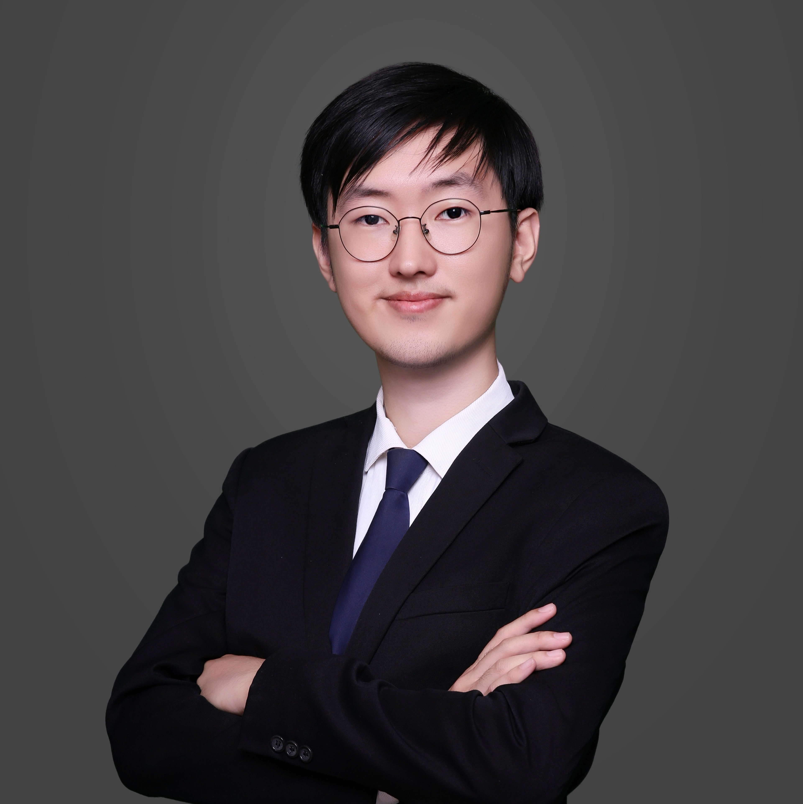

:::: {.columns}

::: {.column width="65%"}
I am a first-year Ph.D. student in **Computer Science** at **Rutgers University**, advised by [Professor He Zhu](https://herowanzhu.github.io/). Previously, I completed my undergraduate studies at the **University of California, Irvine**, where I majored in **Computational and Applied Mathematics** with a concentration in **Data Science**.

I have strong interests in **Reinforcement Learning**, **Deep Learning**, and their applications to **computer vision**, **natural language processing**, **code superoptimization**, **automated driving**, and **AI for mathematics (AI4Math)**, with relevant [**research**](research.qmd) and [**project**](projects.qmd) experience in some of these areas. I also have over a year of [**work and internship experience**](cv.qmd#work-experience) across different fields, including Internet services, automobile, FinTech, and education, which gives me an understanding of real-world industry challenges. Together with a solid academic background, this enables me not only to pursue theoretical innovations but also to apply them to solve practical problems.   

My goal is to leverage computer algorithms and automation technologies to free humanity from repetitive physical and mental labor, allowing us to focus on creativity and imagination, and ultimately to accelerate scientific progress and human well-being.

**Contact me:** [luoning.zhang@rutgers.edu](mailto:luoning.zhang@rutgers.edu) | Here's my [**Curriculum Vitae (CV)**](Luoning Zhang_CV.pdf)

:::

::: {.column width="35%"}
{.profile-photo}

  <a href="mailto:luoning.zhang@rutgers.edu" class="social-icon">
    <i class="fas fa-envelope"></i>
  </a>
  <a href="https://www.linkedin.com/in/luoning-zhang" class="social-icon">
    <i class="fab fa-linkedin"></i>
  </a>
  <a href="https://github.com/luoninz1" class="social-icon">
    <i class="fab fa-github"></i>
  </a>

:::

::::

## Research Interests

- Reinforcement Learning  
- Deep Learning  
- Neuro-symbolic AI
- Multi-armed Bandits
- Automated Driving  
- Code Superoptimization
- AI4Math

## Skills

- **Programming:** Python, R, MATLAB, C  
- **Machine Learning:** PyTorch, Keras, Scikit-learn; familiar with deep learning, reinforcement learning, and hyperparameter optimization  
- **Data Analysis & Scientific Computing:** Pandas, NumPy, SciPy, Numba, Matplotlib, Seaborn, SQL, Tableau, ANSYS, Excel  
- **Embedded Systems:** Analog & Digital Circuits, 8051 MCU Development, Arduino  
- **Tools:** Git, Slurm, LaTeX  
- **Design & Media Production:** SolidWorks, CorelDRAW, Photoshop, Canva, CapCut, VideoStudio, OBS  
- **Languages:** Fluent in English and Chinese

## Education
- **University of California, Irvine**  
  *B.S. in Applied and Computational Mathematics (Data Science Concentration)*  
  *September 2020 – December 2025*  
  GPA: **3.85** (Upper-division GPA: **4.00**)  
  Dean’s Honor List  

